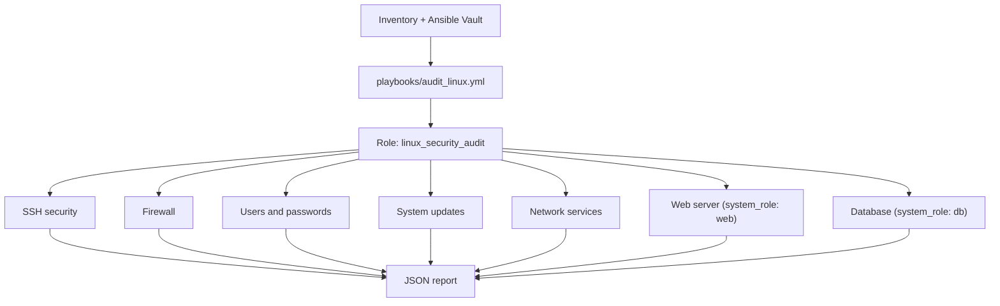

# suzune_check

[](https://github.com/Giremuu/suzune_check/actions/workflows/ci.yml)


Host-based Linux security audit tool built with Ansible, inspired by ANSSI best practices. Runs read-only checks on Debian and Ubuntu hosts and produces a JSON report. No configuration is modified.

---

## Overview



### Project structure

```
suzune_check/
├── ansible.cfg
├── playbooks/
│   └── audit_linux.yml
├── roles/
│   └── linux_security_audit/
│       ├── defaults/
│       │   └── main.yml            - Configurable thresholds and output options
│       └── tasks/
│           ├── main.yml            - Entry point, runs checks by tag
│           ├── report.yml          - JSON report generation
│           └── checks/
│               ├── ssh_security.yml
│               ├── firewall.yml
│               ├── users_passwords.yml
│               ├── system_update.yml
│               ├── network_services.yml
│               ├── web.yml         - Optional (system_role: web)
│               └── db.yml          - Optional (system_role: db)
└── inventory/
    ├── hosts-exemple.yml
    └── host_vars/
        └── <hostname>/
            └── vault.yml           - Per-host secrets (Ansible Vault)
```

---

## Usage

### Prerequisites

- Target: Debian or Ubuntu, reachable via SSH
- Ansible control node on the same network
- Valid Ansible inventory
- Credentials stored in Ansible Vault

### First connection (SSH host key)

Before running the playbook, connect manually once to each host to accept its host key.

```bash
eval "$(ssh-agent -s)"
ssh-add ~/.ssh/id_*
ssh user@host
```

### Run the audit

```bash
# Full audit
ansible-playbook playbooks/audit_linux.yml --ask-vault-pass

# Run a specific check group only
ansible-playbook playbooks/audit_linux.yml --ask-vault-pass --tags ssh
ansible-playbook playbooks/audit_linux.yml --ask-vault-pass --tags firewall,users
```

---

## Specificities

### Available tags

| Tag | Check group |
|---|---|
| `ssh` | SSH configuration |
| `firewall` | UFW / firewalld / nftables |
| `users` | Users and password policies |
| `updates` | Pending upgrades and unattended-upgrades |
| `network` | Listening ports, telnet, IPv6, world-writable files |
| `web` | Apache / Nginx detection and HTTPS exposure (system_role: web) |
| `db` | MariaDB / MySQL / PostgreSQL detection and exposure (system_role: db) |
| `report` | JSON report generation |

### Checks performed

**SSH security**
- Root login disabled
- Password authentication disabled (key-based only)
- Protocol 2 enforced

**Firewall**
- UFW / firewalld / nftables active status
- Global firewall status: OK if at least one is active

**Users and passwords**
- Accounts with empty password field (`/etc/shadow`)
- Password expiration policy (`PASS_MAX_DAYS` vs `max_password_age_days`)
- `sudo` installed and admin group present
- Root account password locked

**System updates**
- Pending package upgrades
- `unattended-upgrades` enabled
- System uptime vs `max_uptime_days`

**Network and filesystem**
- Listening ports inventory
- Telnet disabled
- IPv6 status
- World-writable files in system directories

**Web server** (when `system_role: web`)
- Apache / Nginx detection
- HTTP / HTTPS ports exposed
- HTTPS present when a web service is running
- Web server version disclosure check

**Database** (when `system_role: db`)
- MariaDB / MySQL / PostgreSQL detection
- Database ports exposed
- PostgreSQL `listen_addresses` scope

### Output

A JSON report is generated on the control machine:

```
/var/tmp/security_audit_<hostname>_<date>.json
```

Each report contains:
- Summary (OK / WARN / FAIL / INFO counts)
- Global score
- Per-control results with evidence and remediation guidance

Output path and file generation can be changed in `roles/linux_security_audit/defaults/main.yml`.

### Configuration

Key defaults in `roles/linux_security_audit/defaults/main.yml`:

| Variable | Default | Description |
|---|---|---|
| `audit_framework` | `anssi` | Audit reference framework |
| `audit_profile` | `server` | Audit profile (overridable per host) |
| `system_role` | `generic` | Enables web or db optional checks |
| `max_password_age_days` | `365` | Password expiration threshold |
| `max_uptime_days` | `7` | Uptime threshold before WARN |
| `save_report_to_file` | `true` | Write JSON report to disk |
| `report_output_dir` | `/var/tmp` | Report output directory |

### Credentials

Secrets are stored per host using Ansible Vault:

```
inventory/host_vars/<hostname>/vault.yml
```

Each host can define its own `ansible_become_password`. Vault is never committed.

---

## License

MIT - see [LICENSE](LICENSE) for details.
